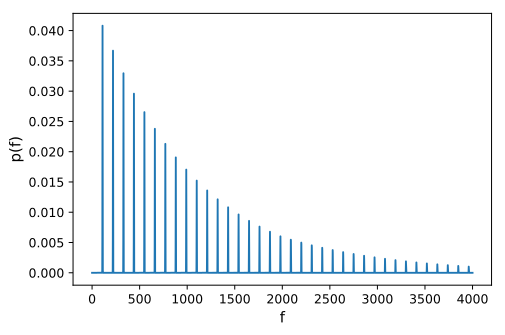
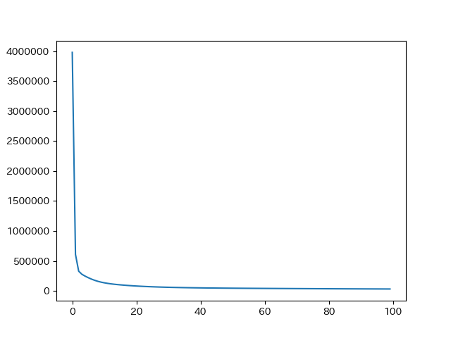
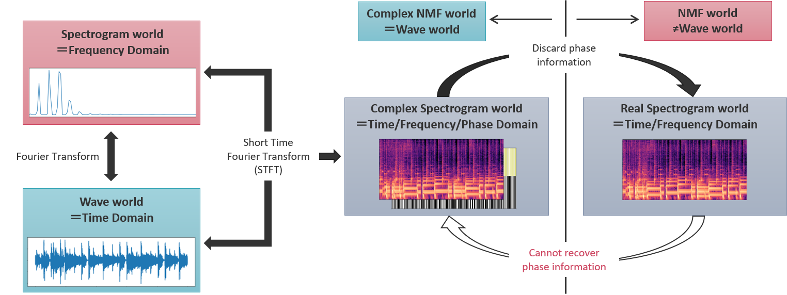
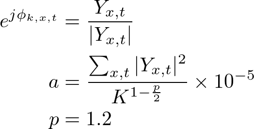
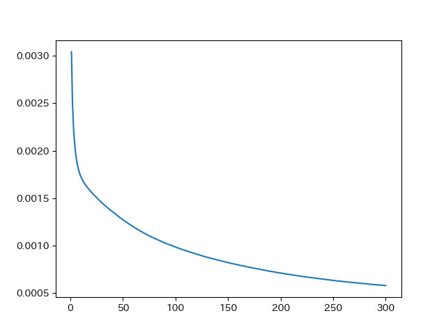

# Complex_NMF
This repository is for using NMF and complex NMF. Comments in the codes are written in Japanese.

<br>

# Description
Main contents are devided into two types.
1. NMF: just decomposing non negative spectrogram into basis and activation.
2. CNMF: decomposing complex spectrogram with using phase values.

In this context, the basis matrix is considered to be fixed. Therefore, please give them initial basis matrix as a fixed matrix. Note that the activation is initialized by gaussian distribution.

<br>

# Usage
## NMF
First, please prepare the spectrogram whose type is ndarray. Also, prepare the initial values of basis matrix, which is fixed through the overall irerations. Note that the number of frequency bins must be the same number between the spectrogram and the initial values.

<br>

<div align="center">

</div>

<br>

```
$ python NMF.py [path_to_spectrogram.npy] [iterations] [path_to_initial_values]
```

<br>

Arguments:  
1. Path to the spectrogram file made by ndarray.
2. The number of overall iterations.
3. Path to the initial values of basis matrix


Return:
- Basis matrix (basis_calc.npy)
- Activation matrix (activation_calc.npy)
- Errors based on the euclid_divergence (cost.npy)  
※Automatically saved ndarray as ".npy". In addition, automatically draw the learning curve.
<div align="center">

</div>

<br>

## Complex NMF
<div align="center">

</div>

<br>

As the case of NMF, please prepare the spectrigram with ndarray. At the same time, make the initial values as fixed matrix. Then the activation matrix is initialized using the same way as NMF while phase matrix is initialized as follows. It is based on the original paper of complex NMF[1].

<br>

<div align="center">

</div>  

<br>

```
$ python CNMF.py [path_to_spectrogram.npy] [iterations] [path_to_initial_values] -thr [threshold]
```

<br>

Arguments:  
1. Path to the spectrogram file made by ndarray.
2. The number of overall iterations.
3. Path to the initial values of basis matrix
4. Threshold of the error (optional)


Return:
- Basis matrix (basis_calc.npy)
- Activation matrix (activation_calc.npy)
- Exponential-phase matrix (phase_calc.npy)
- Reconstructed spectrigram (reconst.npy)
- Errors based on the euclid_divergence (cost.npy)  

※Automatically saved ndarray as ".npy". In addition, automatically draw the learning curve.
<div align="center">

</div>

<br>

# References
[1] Kameoka, Hirokazu, et al. "Complex NMF: A new sparse representation for acoustic signals." 2009 IEEE International Conference on Acoustics, Speech and Signal Processing. IEEE, 2009.
