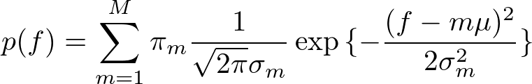

# Complex_NMF
<div align="center">

</div>

<br>

This repository is for using NMF and complex NMF. Comments in the codes are written in Japanese.

<br>

# Description
The main contents are divided into two types.
1. NMF: just decomposing non-negative spectrogram into basis and activation.
2. CNMF: decomposing complex spectrogram with using phase values.

In this context, the basis matrix is considered to be fixed. Therefore, please give them an initial basis matrix as a fixed matrix. Note that the activation is initialized by Gaussian distribution.

<br>

# Usage
## Making initialized basis spectrogram
In order to conduct source separation, a basis supectrogram should be prepared. You have to prepare wav files in advance which are used for making a basis spectrogram. In this repository, we prepare some samples of the wav files. These templates are sampled from Musescore, one of the most popular notation software. In this repository named "basis_wav_piano" includes 3 octaves of single piano sound. Then using the code below, you can make fixed basis spectrograms which are made through NMF (They include noise, and we strongly recommend that you should prepare them by yourself).

<br>

```
$ python make_init.py [path_to_template_directory]
```

<br>

Arguments:  
1. Path to the directory which includes template wav files.


Return:
- Basis matrix (fixed_basis.npy)

<br>

In this algorithm, I adopt the parameters based on the harmonic feature of the piano as follows. 130.81 is the frequency of C3. Also, the damping coefficient is set as 0.9, variance as 1.0 and the number of the Gaussian peak as 50.

<br>

<div align="center">

</div>

<br>

<div align="center">

</div>

<br>

<div align="center">

</div>

<br>

Those parameters determine the initial values of NMF to make basis spectrograms. Furthermore, you can prepare another template. Note that default settings basically rely on the librosa's ones.

<br>

<div align="center">

</div>


## NMF
First, please prepare the spectrogram whose type is ndarray. Also, prepare the initial values of the basis matrix, which is fixed through the overall iterations. Note that the number of frequency bins must be the same number between the spectrogram and the initial values.

<br>


<br>

```
$ python NMF.py [path_to_spectrogram.npy] [iterations] [path_to_initial_values]
```

<br>

Arguments:  
1. Path to the spectrogram file made by ndarray.
2. The number of overall iterations.
3. Path to the initial values of basis matrix


Return:
- Basis matrix (basis_calc.npy)
- Activation matrix (activation_calc.npy)
- Errors based on the euclid_divergence (cost.npy)  
※Automatically saved ndarray as ".npy". In addition, automatically draw the learning curve.
<div align="center">

</div>

<br>

## Complex NMF
As the case of NMF, please prepare the spectrogram with ndarray. At the same time, make the initial values as a fixed matrix. Then the activation matrix is initialized using the same way as NMF while the phase matrix is initialized as follows. It is based on the original paper of complex NMF[2].

<br>

<div align="center">

</div>  

<br>

```
$ python CNMF.py [path_to_spectrogram.npy] [iterations] [path_to_initial_values] -thr [threshold]
```

<br>

Arguments:  
1. Path to the spectrogram file made by ndarray.
2. The number of overall iterations.
3. Path to the initial values of the basis matrix
4. A threshold of the error (optional)


Return:
- Basis matrix (basis_calc.npy)
- Activation matrix (activation_calc.npy)
- Exponential-phase matrix (phase_calc.npy)
- Reconstructed spectrigram (reconst.npy)
- Errors based on the euclid_divergence (cost.npy)  

※Automatically saved ndarray as ".npy". In addition, automatically draw the learning curve.
<div align="center">

</div>

<br>

# References
[1] Kameoka, Hirokazu, et al. "Complex NMF: A new sparse representation for acoustic signals." 2009 IEEE International Conference on Acoustics, Speech and Signal Processing. IEEE, 2009.
